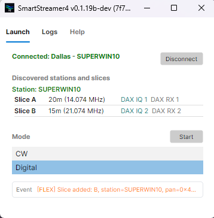
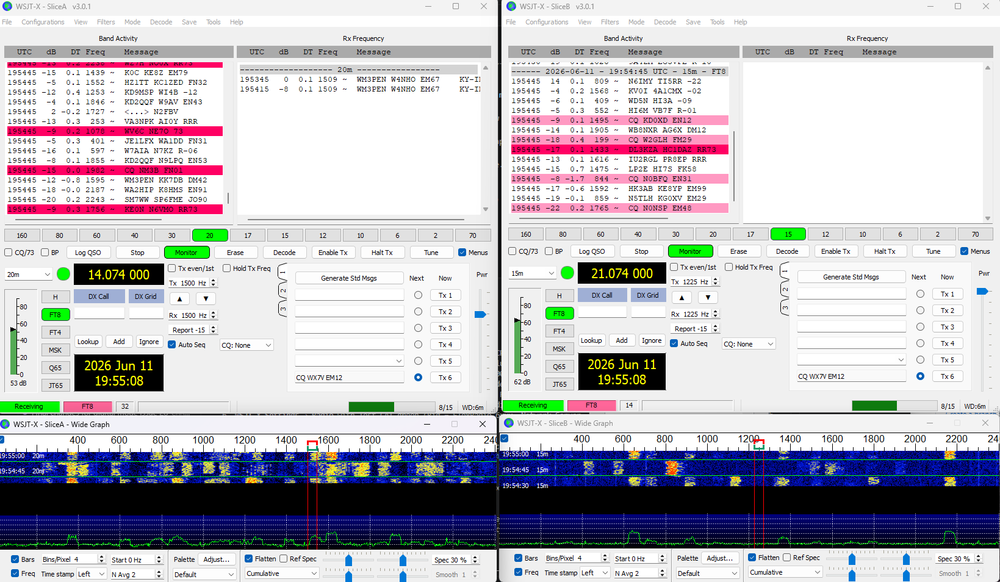
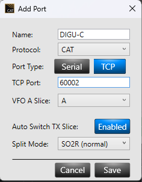
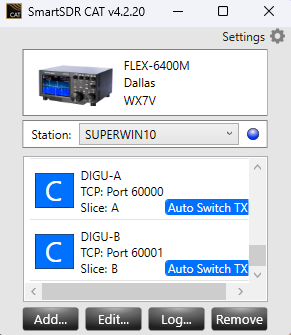
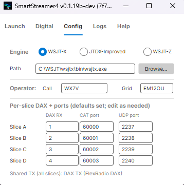
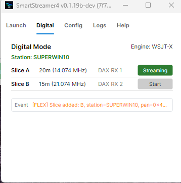
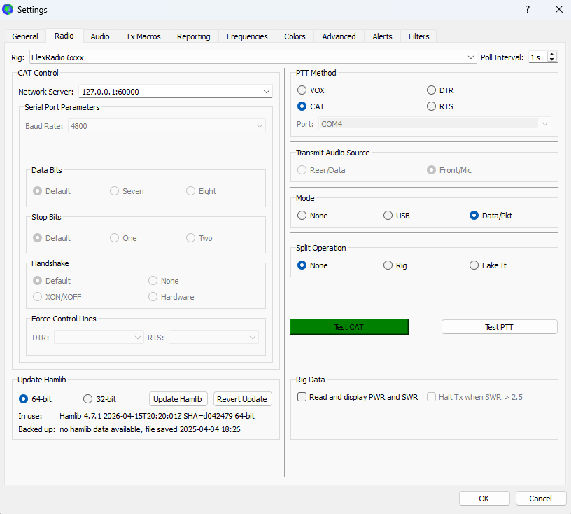
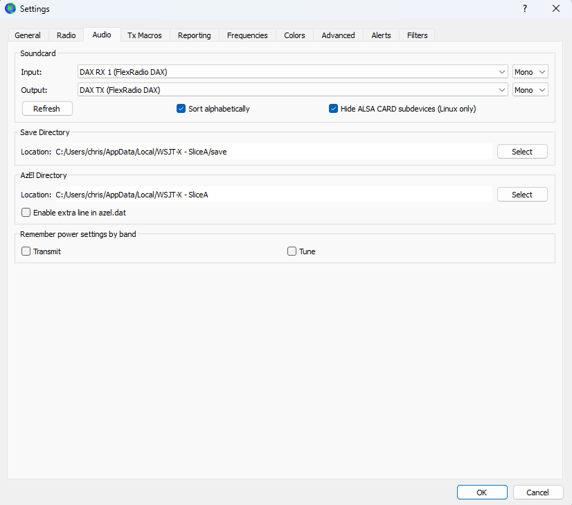
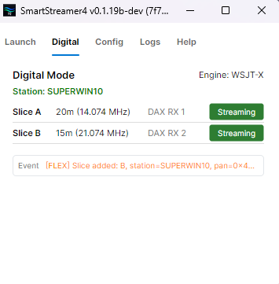

# SmartStreamer4 Setup Guide

SmartStreamer4 has two operating modes, chosen on the Launch tab after you
connect to your radio:

- **CW Mode** runs CW Skimmer with deep integration: the streamer routes
  DAX-IQ audio, keeps CW Skimmer's frequency in sync with your panadapter
  and slice, and publishes decoded spots back to SmartSDR.
- **Digital Mode** sets up and launches WSJT-X, JTDX-Improved, or WSJT-Z
  (FT8/FT4): the streamer writes each instance's configuration (audio
  devices, CAT port, UDP port, call, grid) and starts one instance per
  slice. The engine then talks to the radio directly over DAX audio and
  SmartSDR CAT; the streamer does not relay spots in Digital Mode.

This guide is reference material: prerequisites, the Launch workflow, the
configuration each mode needs, and a troubleshooting decision tree. For the
hands-on first-time CW setup flow, click **Set Up Wizard** on the CW Config
tab (it auto-opens on first install once both CW Skimmer paths are set).

---

## Prerequisites Checklist

Required for both modes:

- Windows 10/11 is supported today (FlexLib .NET 8.0 requirement)
- FLEX-6000/8000 radio is powered on and connected to the local network
- SmartSDR 4.x installed and running (SmartStreamer4 is designed for SmartSDR 4.x; firmware ≥ 3.3.32 required)
- DAX 4.x installed and running

CW Mode additionally needs:

- CW Skimmer v2.1 installed
- A DAX-IQ stream enabled in the SmartSDR panadapter
- The matching DAX-IQ channel enabled in SmartSDR DAX (blue/streaming)

Digital Mode additionally needs:

- At least one engine installed: WSJT-X, JTDX-Improved, or WSJT-Z
- SmartSDR CAT running (installed with SmartSDR)
- A DAX audio (RX) channel assigned to each slice you will use
- A CAT TCP port per slice (one-time setup; see the Digital Mode pages)

If any item above is missing, stop and fix that first.

- The radio and skimmer software prerequisites can be downloaded from these sites as of 4/20/2026:
  - [https://www.flexradio.com/ssdr/](https://www.flexradio.com/ssdr/)
  - [https://www.dxatlas.com/CwSkimmer/](https://www.dxatlas.com/CwSkimmer/)
  - [https://wsjt.sourceforge.io/wsjtx.html](https://wsjt.sourceforge.io/wsjtx.html)


---

## Connect and Choose a Mode (Launch Tab)

The Launch tab is the app's home: it is the only place you connect to a
radio, and it is where you enter and exit a mode.

1. Start SmartStreamer4. Discovered radios appear in the list; select one
   and click `Connect`.
2. Once connected, the tab lists the radio's stations and, per station,
   the slices with their band/frequency, DAX-IQ channel, and DAX RX
   channel.
3. Under `Mode`, select **CW** or **Digital** and click `Start`. The
   chosen mode's working tabs appear next to Launch (CW Mode: `CW` +
   `Config`; Digital Mode: `Digital` + `Config`). `Launch`, `Logs`, and
   `Help` are always visible.
4. To switch modes, click `Stop` first. If anything is still running
   (CW Skimmer instances or digital engines), the streamer confirms and
   then shuts them down cleanly before returning to mode selection.



Mode advice is soft: if a slice's mode does not fit the chosen mode (for
example a CW slice in Digital Mode), the slice row shows a notice but you
can still launch.

---

## CW Mode - The Set Up Wizard

The **Set Up Wizard** (the orange link on the CW Config tab) is the
recommended way to do first-time setup or reconfigure CW Skimmer for
SmartStreamer4. It is *not* just a destructive cleanup; it is an
interactive 4-step walkthrough that:

1. Launches CW Skimmer with your configured exe path so you can size and
   position the window where you want it.
2. Guides you through the Settings → Radio tab values (SoftRock, 48 kHz,
   Audio IF=0).
3. Asks you to choose **MME (recommended)** vs **WDM (experimental)** as the
   Soundcard Driver mode, then captures the per-channel device numbers shown
   in CW Skimmer's Audio tab dropdowns. WDM dropdown ordering differs by PC,
   so this manual capture is the only reliable way to drive multi-channel
   WDM (see [issue #19](https://github.com/cdub89/SmartStreamer4/issues/19)).
4. Verifies CW Skimmer is closed (so your settings actually save), then
   deletes the per-channel INIs so they re-seed from your updated master.

Open the wizard when:

- You are setting up SmartStreamer4 for the first time (it auto-opens once
  both paths point to existing files).
- You want to switch Soundcard Driver mode (MME ↔ WDM).
- You moved to a different PC and the WDM device numbers changed.
- A release explicitly notes a channel-INI schema change.

The wizard is harmless to re-run: it never modifies your master
`cwskimmer.ini`, only the streamer-managed channel files.

---

## CW Mode - Paths and File Locations

The wizard needs two paths set on the CW Config tab before it can launch
CW Skimmer:

Typical CwSkimmer.exe path:

```text
C:\Program Files (x86)\Afreet\CwSkimmer\CwSkimmer.exe
```

Typical CwSkimmer.ini path (replace user name with your own):

```text
C:\Users\chris\AppData\Roaming\Afreet\Products\CwSkimmer\CwSkimmer.ini
```

Use the Browse buttons on the Config tab to locate both. Once both point at
existing files, the Set Up Wizard auto-opens on first install.

---

## CW Mode - What the Wizard Configures (Reference)

The wizard handles the Radio and Audio tabs end-to-end. This section is
reference material if you are diagnosing what the wizard wrote.

### Radio tab values the wizard sets

- Hardware Type: SoftRock
- Sample Rate: 48000 Hz
- Audio IF: 0 Hz
- LO Frequency: rewritten on every launch from the live panadapter center.


### Audio tab values

- **Soundcard Driver**: MME (recommended) or WDM (experimental). The wizard
  asks the operator to pick.
- **Signal I/O Device**: in MME mode, auto-derived by looking up
  `DAX IQ {N}` in the live WinMM enumeration; in WDM mode, taken from the
  per-channel numbers the operator captures in the wizard.
- **Audio I/O Device**: copied verbatim from the master INI - this is your
  local speakers/headphones, used only for CW Skimmer's local audio
  monitoring.
- **Channels**: `Left/Right = I / Q`
- **Shift Right Channel Data by**: `0 samples`

#### DAX IQ endpoint friendly names

The Signal I/O Device dropdown the wizard auto-fills shows different
friendly names depending on which SmartSDR version installed the DAX
driver. The wizard matches on the `DAX IQ {N}` prefix so both forms
work, but the strings you see in the dropdown (and in the Windows
Sound control panel) differ:

| Channel | SmartSDR 4.2.x             | SmartSDR 4.1.5                              |
| ------- | -------------------------- | ------------------------------------------- |
| 1       | `DAX IQ 1 (FlexRadio DAX)` | `DAX IQ RX 1 (FlexRadio Systems DAX IQ)`    |
| 2       | `DAX IQ 2 (FlexRadio DAX)` | `DAX IQ RX 2 (FlexRadio Systems DAX IQ)`    |
| 3       | `DAX IQ 3 (FlexRadio DAX)` | `DAX IQ RX 3 (FlexRadio Systems DAX IQ)`    |
| 4       | `DAX IQ 4 (FlexRadio DAX)` | `DAX IQ RX 4 (FlexRadio Systems DAX IQ)`    |

If neither form appears in the dropdown, DAX is not installed or the
DAX service is not running. The startup gate (added in v0.1.18b)
catches the second case before you reach this step.

### Operator and Network tabs

These are not rewritten by the streamer (Network telnet port is the
exception - it is rewritten on every launch). Set callsign and operator
defaults manually inside CW Skimmer before closing.


---

## CW Mode - Spot Persistence and Colors

Configured on the CW Config tab independent of the wizard.

- In `Config`, use `Persist` to control spot lifetime (seconds) for newly published spots.
- Use `Txt` to choose spot text color and `Bg` to choose spot background color.
- Start with a readable combination (for example yellow text on transparent/dark background).
- Validate by publishing at least one known spot and confirming appearance in SmartSDR panadapter.

Streamer Config example:


---

## CW Mode - Start and Stop Skimming

Connect to the radio and start CW Mode from the Launch tab first, then go
to the `CW` tab. Per slice, use the skimmer action button:

- `Start` means skimmer is not running for that slice channel.
- `Streaming` means skimmer is running for that slice channel.

Normal flow:

1. Confirm the connected station/pan/slice state appears correctly and a
   DAX-IQ context is available for the intended channels.
2. Click `Start` on the target slice row.
3. Wait for the CW Skimmer window and startup status.
4. Verify decode activity and expected frequency behavior.

Operating tab while skimming example:


To stop from streamer:

1. Click `Streaming` on the active slice row.
2. Confirm CW Skimmer instance stops for that channel.

To stop manually (required if you've made config changes you want saved for the next time you start CW Skimmer):

1. Close CW Skimmer window directly.
2. Confirm streamer status reflects stopped state.

If radio is disconnected from streamer, streamer should also stop active skimmer instances.

---

## CW Mode - Troubleshooting (Quick Decision Tree)

### A) CW Skimmer does not launch

- Recheck `CwSkimmer.exe` path in streamer `Config`.
- Confirm DAX devices exist and are visible to CW Skimmer.
- Check `artifacts/logs` and streamer `Logs` tab for launch diagnostics.
- If CW Skimmer crashes within ~10 seconds with no message
  (`exit_code=-1073740771` / `STATUS_FATAL_USER_CALLBACK_EXCEPTION` in the
  logs), this is a known intermittent CW Skimmer startup fault. Click
  `Start` again from SmartStreamer4; it usually launches cleanly on the
  second attempt.

### B) Wrong audio/input behavior after launch

- Re-run the **Set Up Wizard** from the CW Config tab. Step 3 lets you
  re-capture the per-channel MME/WDM device numbers and switch driver mode.
- The wizard's "Reset and Done" deletes the per-channel INIs so the next
  launch re-seeds with your updated values. The streamer only writes the
  `[Audio]` section on first creation, so deleting is what makes wizard
  changes take effect.
- Your manual `CwSkimmer.ini` baseline is never modified.
- **Logs are separate** and not affected by Reset. They are append-only
  diagnostic data under `artifacts/logs/`; if disk usage is a concern,
  delete them manually.

### C) Settings not retained as expected

- Confirm master INI is stable when CW Skimmer is run standalone.
- Confirm per-channel INI already exists and is not being replaced unexpectedly.
- Verify whether close path was manual CW close, streamer stop, or disconnect.

### D) No decode / poor decode

- Confirm correct DAX IQ channel routing and levels.
- Check sample rate consistency between radio/DAX/CW expectations.
- Validate center frequency and tuning sync behavior in logs.

### E) Telnet/sync anomalies

- Check for local port conflicts.
- Check firewall/endpoint protection rules for local loopback behavior.
- Review `[TELNET]` lines in streamer logs.

---

## Digital Mode - Overview

Digital Mode turns SmartStreamer4 into a setup-and-launch manager for
FT8/FT4 engines on a FlexRadio:

- **Engines**: WSJT-X, JTDX-Improved, and WSJT-Z. One engine is active at
  a time (chosen on the Digital Config tab); you can run one instance of
  it per slice, up to your radio's slice limit.
- **What the streamer does**: before each launch it writes the instance's
  configuration (DAX audio devices, CAT TCP port, UDP reporting port,
  your call and grid) and starts the engine with a per-slice profile
  (`--rig-name SliceA`, `SliceB`, ...). Each instance keeps its own
  settings under `%LOCALAPPDATA%` (for example `WSJT-X - SliceA`).
  WSJT-Z is a WSJT-X fork and shares the WSJT-X configuration layout.
- **What the engine does**: decodes and transmits on its own, talking to
  the radio directly over DAX audio and a SmartSDR CAT TCP port. The
  streamer does not relay spots or audio in Digital Mode.
- **First launch vs. later launches**: the first launch for a slice seeds
  the instance from a known-good FlexRadio template (PTT=CAT, Data/Pkt
  mode, split off). After that, the streamer preserves everything the
  engine saved (window layout, last protocol, band) and re-applies only
  the binding values above.

Two instances running at once, one per slice:



One-time setup before your first digital launch (next page): create a
CAT TCP port per slice in SmartSDR CAT, and assign each slice a DAX
audio channel.

---

## Digital Mode - SmartSDR Setup (CAT Ports and DAX)

These steps happen in SmartSDR's CAT and DAX apps, not in SmartStreamer4.
The FlexRadio API does not let the streamer create CAT ports, so this is
a one-time manual setup.

### Create a CAT TCP port for each slice

1. Open **SmartSDR CAT** (installed with SmartSDR; look for it in the
   system tray or Start menu).
2. At the top of the CAT window, select the **Station** you operate (the
   same station whose slices you will launch from the streamer).
3. Click **ADD** to create a new port.
4. **Name**: anything memorable, for example `WSJTX Slice A`.
5. **Protocol**: CAT.
6. **Port type**: **TCP** (not a COM/serial port).
7. **TCP Port**: `60000` for Slice A. Any free port works, but the
   streamer's defaults assume 60000 plus one per slice.
8. **Slice**: A.
9. Enable **Auto Switch TX Slice** (lets the engine key the correct
   slice on transmit).
10. Click **Save**.
11. Repeat for each additional slice you will use: Slice B = `60001`,
    Slice C = `60002`, Slice D = `60003`.

The Add Port dialog, filled in for a TCP CAT port:



SmartSDR CAT after setup, with TCP ports bound to Slice A and Slice B:



The port numbers must match the per-slice **CAT port** column on the
streamer's Digital Config tab (defaults: 60000, 60001, ...). If you chose
different numbers, edit the Config tab to match.

### Assign DAX audio channels and TX

1. In **SmartSDR DAX**, select the same Station.
2. In SmartSDR, set each slice you will use to mode **DIGU** and assign
   it a **DAX channel** (slice flag pulldown): Slice A to DAX 1,
   Slice B to DAX 2, and so on. The streamer's Digital tab shows the
   assigned channel per slice (`DAX RX n`) and disables `Start` until one
   is assigned.
3. Enable the **TX DAX** button in SmartSDR's radio controls. All
   instances share the single `DAX TX (FlexRadio DAX)` device for
   transmit audio.

---

## Digital Mode - Config Tab

Start Digital Mode from the Launch tab, then open the `Config` tab.

- **Engine**: pick WSJT-X, JTDX-Improved, or WSJT-Z. The choice is locked
  while any instance is running; stop all instances to switch.
- **Path**: the engine executable. Defaults:
  - WSJT-X: `C:\WSJT\wsjtx\bin\wsjtx.exe`
  - JTDX-Improved: `C:\JTDX64\<version>\bin\jtdx.exe` (the JTDX install
    path embeds a version number, so use Browse to point at yours)
  - WSJT-Z: `C:\WSJT\wsjtz\bin\wsjtx.exe` (WSJT-Z's exe is also named
    `wsjtx.exe`)
- **Operator Call / Grid**: written into each instance's configuration.
  If you already use the engine with your FlexRadio, these prepopulate
  from your existing configuration.
- **Per-slice DAX + ports**: one row per slice with **DAX RX**, **CAT
  port**, and **UDP port**. Defaults are Slice A = DAX RX 1 / CAT 60000 /
  UDP 2237, Slice B = 2 / 60001 / 2238, and so on. The CAT port must
  match the TCP port you created in SmartSDR CAT for that slice; the UDP
  port must be unique per slice (it is the engine's UDP reporting port,
  consumed by tools like JTAlert and GridTracker).
- **Shared TX**: all slices transmit through the single
  `DAX TX (FlexRadio DAX)` device; nothing to configure per slice.



---

## Digital Mode - Start and Stop (Digital Tab)

The `Digital` tab shows one row per slice of the connected station:
slice letter, band and frequency, the slice's assigned DAX RX channel,
and a `Start` button.

- `Start` provisions the instance's configuration and launches the active
  engine for that slice. The button is disabled until the slice has a
  DAX audio channel assigned in SmartSDR.
- A notice appears if the slice's mode is not USB/DIGU (the engine needs
  USB/DIGU audio to decode); you can still launch.
- `Streaming` means the instance is running; click it to stop. The
  streamer closes the engine gracefully so it saves its settings; closing
  the engine's window directly is also fine.
- Disconnecting the radio stops all running instances.



On your first launch, verify inside the engine that everything is wired:

1. **Settings → Radio**: Rig = `FlexRadio 6xxx`, Network Server =
   `127.0.0.1:<your CAT port>`, PTT = CAT. Press `Test CAT`; it must go
   green. `Test PTT` should key the radio.
2. **Settings → Audio**: Input = `DAX RX <n> (FlexRadio DAX)`, Output =
   `DAX TX (FlexRadio DAX)`.
3. Confirm FT8 decodes appear on a busy band.

WSJT-X Settings → Radio with Test CAT green:



WSJT-X Settings → Audio with the DAX devices selected:



With both slices started, every row shows Streaming:



---

## Digital Mode - Troubleshooting

### A) Engine does not start

- Recheck the engine `Path` on the Digital Config tab (JTDX's default
  path changes with its version).
- Check the streamer `Logs` tab for launch diagnostics.

### B) Audio devices show "(Not found)" in the engine

- The DAX app must be running before the engine starts, or the DAX
  devices do not appear. Start DAX, then relaunch.
- A configuration from an older DAX version may hold stale device names
  (`DAX Audio RX 1 (FlexRadio Systems DAX Audio)`). The current names are
  `DAX RX <n> (FlexRadio DAX)` and `DAX TX (FlexRadio DAX)`; re-select
  them in Settings → Audio.

### C) Test CAT fails / engine cannot control the radio

- Confirm the CAT TCP port exists in SmartSDR CAT for that slice and is
  type TCP, not a COM/serial port.
- Confirm the port number matches the slice's CAT port on the Digital
  Config tab.
- Confirm SmartSDR CAT has the correct Station selected.

### D) Decoding works but transmit does not

- Enable the **TX DAX** button in SmartSDR's radio controls.
- Confirm **Auto Switch TX Slice** is enabled on the CAT port.
- Confirm PTT = CAT in the engine's Settings → Radio.

### E) Multiple instances interfere

- Each slice needs a unique CAT TCP port and a unique UDP port (Digital
  Config tab). Shared UDP ports collide in tools like JTAlert and
  GridTracker.

---

## Logs, Artifacts, and First-Time Validation

Artifacts and logs reference:

- Streamer logs: `artifacts/logs/streamer-status.log`
- Spot publish logs (CW Mode): `artifacts/logs/spot-publish.log`
- CW Skimmer managed INIs: `artifacts/cwskimmer/ini`
- Device diagnostic log: `artifacts/cwskimmer/ini/device-diagnostic.txt`
- Digital per-instance configs: `%LOCALAPPDATA%\<engine> - Slice<letter>\`
  (for example `WSJT-X - SliceA`)

Example of healthy connected operating state during validation:


Recommended first-time CW Mode validation run:

1. Connect and start CW Mode from the Launch tab.
2. Start one channel with `START`.
3. Validate decode and sync for at least 5 minutes.
4. Stop and restart once.
5. Disconnect/reconnect radio once.
6. Confirm behavior and settings remain consistent.

Recommended first-time Digital Mode validation run:

1. Connect and start Digital Mode from the Launch tab.
2. Start one slice and confirm `Test CAT` is green and FT8 decodes appear.
3. Stop the instance, restart it, and confirm the engine's settings
   (window layout, band) survived the restart.

If all checks pass, the system is ready for normal operation.
